```mermaid
flowchart TB
    subgraph current["DataGenerator.csproj"]
        MAIN["<b>📦&nbsp;DataGenerator.csproj</b><br/><small>net8.0</small>"]
        click MAIN "#seeddatadatageneratordatageneratorcsproj"
    end

```

```mermaid
flowchart TB
    subgraph upstream["Dependants (5)"]
        P2["<b>📦&nbsp;AppHost.csproj</b><br/><small>net8.0</small>"]
        P4["<b>📦&nbsp;CustomerWebUI.csproj</b><br/><small>net8.0</small>"]
        P5["<b>📦&nbsp;DataIngestor.csproj</b><br/><small>net8.0</small>"]
        P6["<b>📦&nbsp;Evaluator.csproj</b><br/><small>net8.0</small>"]
        P12["<b>📦&nbsp;EvaluationTests.csproj</b><br/><small>net8.0</small>"]
        click P2 "#srcapphostapphostcsproj"
        click P4 "#srccustomerwebuicustomerwebuicsproj"
        click P5 "#srcdataingestordataingestorcsproj"
        click P6 "#srcevaluatorevaluatorcsproj"
        click P12 "#testevaluationtestsevaluationtestscsproj"
    end
    subgraph current["Backend.csproj"]
        MAIN["<b>📦&nbsp;Backend.csproj</b><br/><small>net8.0</small>"]
        click MAIN "#srcbackendbackendcsproj"
    end
    subgraph downstream["Dependencies (1"]
        P9["<b>📦&nbsp;ServiceDefaults.csproj</b><br/><small>net8.0</small>"]
        click P9 "#srcservicedefaultsservicedefaultscsproj"
    end
    P2 --> MAIN
    P4 --> MAIN
    P5 --> MAIN
    P6 --> MAIN
    P12 --> MAIN
    MAIN --> P9

```

```mermaid
flowchart TB
    subgraph upstream["Dependants (1)"]
        P2["<b>📦&nbsp;AppHost.csproj</b><br/><small>net8.0</small>"]
        click P2 "#srcapphostapphostcsproj"
    end
    subgraph current["CustomerWebUI.csproj"]
        MAIN["<b>📦&nbsp;CustomerWebUI.csproj</b><br/><small>net8.0</small>"]
        click MAIN "#srccustomerwebuicustomerwebuicsproj"
    end
    subgraph downstream["Dependencies (2"]
        P9["<b>📦&nbsp;ServiceDefaults.csproj</b><br/><small>net8.0</small>"]
        P3["<b>📦&nbsp;Backend.csproj</b><br/><small>net8.0</small>"]
        click P9 "#srcservicedefaultsservicedefaultscsproj"
        click P3 "#srcbackendbackendcsproj"
    end
    P2 --> MAIN
    MAIN --> P9
    MAIN --> P3

```

```mermaid
flowchart TB
    subgraph current["DataIngestor.csproj"]
        MAIN["<b>📦&nbsp;DataIngestor.csproj</b><br/><small>net8.0</small>"]
        click MAIN "#srcdataingestordataingestorcsproj"
    end
    subgraph downstream["Dependencies (2"]
        P3["<b>📦&nbsp;Backend.csproj</b><br/><small>net8.0</small>"]
        P6["<b>📦&nbsp;Evaluator.csproj</b><br/><small>net8.0</small>"]
        click P3 "#srcbackendbackendcsproj"
        click P6 "#srcevaluatorevaluatorcsproj"
    end
    MAIN --> P3
    MAIN --> P6

```

```mermaid
flowchart TB
    subgraph upstream["Dependants (1)"]
        P5["<b>📦&nbsp;DataIngestor.csproj</b><br/><small>net8.0</small>"]
        click P5 "#srcdataingestordataingestorcsproj"
    end
    subgraph current["Evaluator.csproj"]
        MAIN["<b>📦&nbsp;Evaluator.csproj</b><br/><small>net8.0</small>"]
        click MAIN "#srcevaluatorevaluatorcsproj"
    end
    subgraph downstream["Dependencies (2"]
        P9["<b>📦&nbsp;ServiceDefaults.csproj</b><br/><small>net8.0</small>"]
        P3["<b>📦&nbsp;Backend.csproj</b><br/><small>net8.0</small>"]
        click P9 "#srcservicedefaultsservicedefaultscsproj"
        click P3 "#srcbackendbackendcsproj"
    end
    P5 --> MAIN
    MAIN --> P9
    MAIN --> P3

```

```mermaid
flowchart TB
    subgraph upstream["Dependants (1)"]
        P2["<b>📦&nbsp;AppHost.csproj</b><br/><small>net8.0</small>"]
        click P2 "#srcapphostapphostcsproj"
    end
    subgraph current["IdentityServer.csproj"]
        MAIN["<b>📦&nbsp;IdentityServer.csproj</b><br/><small>net8.0</small>"]
        click MAIN "#srcidentityserveridentityservercsproj"
    end
    subgraph downstream["Dependencies (1"]
        P9["<b>📦&nbsp;ServiceDefaults.csproj</b><br/><small>net8.0</small>"]
        click P9 "#srcservicedefaultsservicedefaultscsproj"
    end
    P2 --> MAIN
    MAIN --> P9

```

```mermaid
flowchart TB
    subgraph current["PythonInference.pyproj"]
        MAIN["<b>⚙️&nbsp;PythonInference.pyproj</b><br/><small>net472</small>"]
        click MAIN "#srcpythoninferencepythoninferencepyproj"
    end

```

```mermaid
flowchart TB
    subgraph upstream["Dependants (1)"]
        P2["<b>📦&nbsp;AppHost.csproj</b><br/><small>net8.0</small>"]
        click P2 "#srcapphostapphostcsproj"
    end
    subgraph current["StaffWebUI.csproj"]
        MAIN["<b>📦&nbsp;StaffWebUI.csproj</b><br/><small>net8.0</small>"]
        click MAIN "#srcstaffwebuistaffwebuicsproj"
    end
    subgraph downstream["Dependencies (1"]
        P9["<b>📦&nbsp;ServiceDefaults.csproj</b><br/><small>net8.0</small>"]
        click P9 "#srcservicedefaultsservicedefaultscsproj"
    end
    P2 --> MAIN
    MAIN --> P9

```

```mermaid
flowchart TB
    subgraph current["E2ETest.csproj"]
        MAIN["<b>📦&nbsp;E2ETest.csproj</b><br/><small>net8.0</small>"]
        click MAIN "#teste2eteste2etestcsproj"
    end
    subgraph downstream["Dependencies (2"]
        P9["<b>📦&nbsp;ServiceDefaults.csproj</b><br/><small>net8.0</small>"]
        P2["<b>📦&nbsp;AppHost.csproj</b><br/><small>net8.0</small>"]
        click P9 "#srcservicedefaultsservicedefaultscsproj"
        click P2 "#srcapphostapphostcsproj"
    end
    MAIN --> P9
    MAIN --> P2

```

# Projects and dependencies analysis

This document provides a comprehensive overview of the projects and their dependencies in the context of upgrading to .NETCoreApp,Version=v10.0.

## Table of Contents

- [Executive Summary](#executive-Summary)
  - [Highlevel Metrics](#highlevel-metrics)
  - [Projects Compatibility](#projects-compatibility)
  - [Package Compatibility](#package-compatibility)
  - [API Compatibility](#api-compatibility)
- [Aggregate NuGet packages details](#aggregate-nuget-packages-details)
- [Top API Migration Challenges](#top-api-migration-challenges)
  - [Technologies and Features](#technologies-and-features)
  - [Most Frequent API Issues](#most-frequent-api-issues)
- [Projects Relationship Graph](#projects-relationship-graph)
- [Project Details](#project-details)

  - [seeddata\DataGenerator\DataGenerator.csproj](#seeddatadatageneratordatageneratorcsproj)
  - [src\AppHost\AppHost.csproj](#srcapphostapphostcsproj)
  - [src\Backend\Backend.csproj](#srcbackendbackendcsproj)
  - [src\CustomerWebUI\CustomerWebUI.csproj](#srccustomerwebuicustomerwebuicsproj)
  - [src\DataIngestor\DataIngestor.csproj](#srcdataingestordataingestorcsproj)
  - [src\Evaluator\Evaluator.csproj](#srcevaluatorevaluatorcsproj)
  - [src\IdentityServer\IdentityServer.csproj](#srcidentityserveridentityservercsproj)
  - [src\PythonInference\PythonInference.pyproj](#srcpythoninferencepythoninferencepyproj)
  - [src\ServiceDefaults\ServiceDefaults.csproj](#srcservicedefaultsservicedefaultscsproj)
  - [src\StaffWebUI\StaffWebUI.csproj](#srcstaffwebuistaffwebuicsproj)
  - [test\E2ETest\E2ETest.csproj](#teste2eteste2etestcsproj)
  - [test\EvaluationTests\EvaluationTests.csproj](#testevaluationtestsevaluationtestscsproj)

## Executive Summary

### Highlevel Metrics

| Metric | Count | Status |
| :--- | :---: | :--- |
| Total Projects | 12 | All require upgrade |
| Total NuGet Packages | 48 | 19 need upgrade |
| Total Code Files | 157 |  |
| Total Code Files with Incidents | 28 |  |
| Total Lines of Code | 9001 |  |
| Total Number of Issues | 158 |  |
| Estimated LOC to modify | 111+ | at least 1.2% of codebase |

### Projects Compatibility

| Project | Target Framework | Difficulty | Package Issues | API Issues | Est. LOC Impact | Description |
| :--- | :---: | :---: | :---: | :---: | :---: | :--- |
| [seeddata\DataGenerator\DataGenerator.csproj](#seeddatadatageneratordatageneratorcsproj) | net8.0 | 🟢 Low | 2 | 6 | 6+ | DotNetCoreApp, Sdk Style = True |
| [src\AppHost\AppHost.csproj](#srcapphostapphostcsproj) | net8.0 | 🟢 Low | 10 | 0 |  | DotNetCoreApp, Sdk Style = True |
| [src\Backend\Backend.csproj](#srcbackendbackendcsproj) | net8.0 | 🟢 Low | 7 | 11 | 11+ | AspNetCore, Sdk Style = True |
| [src\CustomerWebUI\CustomerWebUI.csproj](#srccustomerwebuicustomerwebuicsproj) | net8.0 | 🟢 Low | 1 | 19 | 19+ | AspNetCore, Sdk Style = True |
| [src\DataIngestor\DataIngestor.csproj](#srcdataingestordataingestorcsproj) | net8.0 | 🟢 Low | 4 | 0 |  | DotNetCoreApp, Sdk Style = True |
| [src\Evaluator\Evaluator.csproj](#srcevaluatorevaluatorcsproj) | net8.0 | 🟢 Low | 0 | 10 | 10+ | DotNetCoreApp, Sdk Style = True |
| [src\IdentityServer\IdentityServer.csproj](#srcidentityserveridentityservercsproj) | net8.0 | 🟢 Low | 0 | 0 |  | AspNetCore, Sdk Style = True |
| [src\PythonInference\PythonInference.pyproj](#srcpythoninferencepythoninferencepyproj) | net472 | 🟢 Low | 0 | 0 |  | ClassicDotNetApp, Sdk Style = False |
| [src\ServiceDefaults\ServiceDefaults.csproj](#srcservicedefaultsservicedefaultscsproj) | net8.0 | 🟢 Low | 5 | 20 | 20+ | ClassLibrary, Sdk Style = True |
| [src\StaffWebUI\StaffWebUI.csproj](#srcstaffwebuistaffwebuicsproj) | net8.0 | 🟢 Low | 4 | 25 | 25+ | AspNetCore, Sdk Style = True |
| [test\E2ETest\E2ETest.csproj](#teste2eteste2etestcsproj) | net8.0 | 🟢 Low | 2 | 2 | 2+ | DotNetCoreApp, Sdk Style = True |
| [test\EvaluationTests\EvaluationTests.csproj](#testevaluationtestsevaluationtestscsproj) | net8.0 | 🟢 Low | 0 | 18 | 18+ | DotNetCoreApp, Sdk Style = True |

### Package Compatibility

| Status | Count | Percentage |
| :--- | :---: | :---: |
| ✅ Compatible | 29 | 60.4% |
| ⚠️ Incompatible | 0 | 0.0% |
| 🔄 Upgrade Recommended | 19 | 39.6% |
| ***Total NuGet Packages*** | ***48*** | ***100%*** |

### API Compatibility

| Category | Count | Impact |
| :--- | :---: | :--- |
| 🔴 Binary Incompatible | 8 | High - Require code changes |
| 🟡 Source Incompatible | 51 | Medium - Needs re-compilation and potential conflicting API error fixing |
| 🔵 Behavioral change | 52 | Low - Behavioral changes that may require testing at runtime |
| ✅ Compatible | 20304 |  |
| ***Total APIs Analyzed*** | ***20415*** |  |

## Aggregate NuGet packages details

| Package | Current Version | Suggested Version | Projects | Description |
| :--- | :---: | :---: | :--- | :--- |
| Aspire.Azure.Storage.Blobs | 8.2.2 | 13.1.2 | [Backend.csproj](#srcbackendbackendcsproj) | NuGet package upgrade is recommended |
| Aspire.Hosting.AppHost | 8.2.2 | 13.1.2 | [AppHost.csproj](#srcapphostapphostcsproj) [DataIngestor.csproj](#srcdataingestordataingestorcsproj) | NuGet package upgrade is recommended |
| Aspire.Hosting.Azure.Storage | 8.2.2 | 13.1.2 | [AppHost.csproj](#srcapphostapphostcsproj) | NuGet package upgrade is recommended |
| Aspire.Hosting.PostgreSQL | 8.2.2 | 13.1.2 | [AppHost.csproj](#srcapphostapphostcsproj) | NuGet package upgrade is recommended |
| Aspire.Hosting.Qdrant | 8.2.2 | 13.1.2 | [AppHost.csproj](#srcapphostapphostcsproj) | NuGet package upgrade is recommended |
| Aspire.Hosting.Redis | 8.2.2 | 13.1.2 | [AppHost.csproj](#srcapphostapphostcsproj) | NuGet package upgrade is recommended |
| Aspire.Hosting.Testing | 8.2.2 | 13.1.2 | [E2ETest.csproj](#teste2eteste2etestcsproj) | NuGet package upgrade is recommended |
| Aspire.Npgsql.EntityFrameworkCore.PostgreSQL | 8.2.2 | 13.1.2 | [Backend.csproj](#srcbackendbackendcsproj) | NuGet package upgrade is recommended |
| Aspire.StackExchange.Redis | 8.2.2 | 13.1.2 | [Backend.csproj](#srcbackendbackendcsproj) [StaffWebUI.csproj](#srcstaffwebuistaffwebuicsproj) | NuGet package upgrade is recommended |
| Azure.AI.OpenAI | 2.1.0-beta.1 |  | [DataGenerator.csproj](#seeddatadatageneratordatageneratorcsproj) [ServiceDefaults.csproj](#srcservicedefaultsservicedefaultscsproj) | ✅Compatible |
| Duende.IdentityServer | 7.0.8 |  | [IdentityServer.csproj](#srcidentityserveridentityservercsproj) | ✅Compatible |
| IdentityModel | 7.0.0 |  | [ServiceDefaults.csproj](#srcservicedefaultsservicedefaultscsproj) | ✅Compatible |
| Markdown2Pdf | 2.2.1 |  | [DataGenerator.csproj](#seeddatadatageneratordatageneratorcsproj) | ✅Compatible |
| Microsoft.AspNetCore.Authentication.JwtBearer | 8.0.10 | 10.0.3 | [Backend.csproj](#srcbackendbackendcsproj) | NuGet package upgrade is recommended |
| Microsoft.AspNetCore.Authentication.OpenIdConnect | 8.0.10 | 10.0.3 | [CustomerWebUI.csproj](#srccustomerwebuicustomerwebuicsproj) [StaffWebUI.csproj](#srcstaffwebuistaffwebuicsproj) | NuGet package upgrade is recommended |
| Microsoft.AspNetCore.Components.QuickGrid | 8.0.10 | 10.0.3 | [StaffWebUI.csproj](#srcstaffwebuistaffwebuicsproj) | NuGet package upgrade is recommended |
| Microsoft.Extensions.AI | 9.4.4-preview.1.25259.16 |  | [DataGenerator.csproj](#seeddatadatageneratordatageneratorcsproj) [ServiceDefaults.csproj](#srcservicedefaultsservicedefaultscsproj) | ✅Compatible |
| Microsoft.Extensions.AI.Evaluation | 9.4.4-preview.1.25259.16 |  | [EvaluationTests.csproj](#testevaluationtestsevaluationtestscsproj) | ✅Compatible |
| Microsoft.Extensions.AI.Evaluation.Quality | 9.4.4-preview.1.25259.16 |  | [EvaluationTests.csproj](#testevaluationtestsevaluationtestscsproj) | ✅Compatible |
| Microsoft.Extensions.AI.Evaluation.Reporting | 9.4.4-preview.1.25259.16 |  | [EvaluationTests.csproj](#testevaluationtestsevaluationtestscsproj) | ✅Compatible |
| Microsoft.Extensions.AI.Ollama | 9.4.4-preview.1.25259.16 |  | [ServiceDefaults.csproj](#srcservicedefaultsservicedefaultscsproj) | ✅Compatible |
| Microsoft.Extensions.AI.OpenAI | 9.4.4-preview.1.25259.16 |  | [DataGenerator.csproj](#seeddatadatageneratordatageneratorcsproj) [ServiceDefaults.csproj](#srcservicedefaultsservicedefaultscsproj) | ✅Compatible |
| Microsoft.Extensions.Configuration.Json | 8.0.1 | 10.0.3 | [DataGenerator.csproj](#seeddatadatageneratordatageneratorcsproj) | NuGet package upgrade is recommended |
| Microsoft.Extensions.Hosting | 8.0.1 | 10.0.3 | [DataGenerator.csproj](#seeddatadatageneratordatageneratorcsproj) | NuGet package upgrade is recommended |
| Microsoft.Extensions.Http.Resilience | 8.10.0 | 10.3.0 | [DataIngestor.csproj](#srcdataingestordataingestorcsproj) [ServiceDefaults.csproj](#srcservicedefaultsservicedefaultscsproj) | NuGet package upgrade is recommended |
| Microsoft.Extensions.ServiceDiscovery | 8.2.2 | 10.3.0 | [ServiceDefaults.csproj](#srcservicedefaultsservicedefaultscsproj) | NuGet package upgrade is recommended |
| Microsoft.FluentUI.AspNetCore.Components | 4.10.3 |  | [StaffWebUI.csproj](#srcstaffwebuistaffwebuicsproj) | ✅Compatible |
| Microsoft.FluentUI.AspNetCore.Components.DataGrid.EntityFrameworkAdapter | 4.10.3 |  | [StaffWebUI.csproj](#srcstaffwebuistaffwebuicsproj) | ✅Compatible |
| Microsoft.FluentUI.AspNetCore.Components.Icons | 4.10.3 |  | [StaffWebUI.csproj](#srcstaffwebuistaffwebuicsproj) | ✅Compatible |
| Microsoft.ML.Tokenizers | 1.0.1 |  | [EvaluationTests.csproj](#testevaluationtestsevaluationtestscsproj) | ✅Compatible |
| Microsoft.ML.Tokenizers.Data.O200kBase | 1.0.1 |  | [EvaluationTests.csproj](#testevaluationtestsevaluationtestscsproj) | ✅Compatible |
| Microsoft.NET.Test.Sdk | 17.11.1 |  | [E2ETest.csproj](#teste2eteste2etestcsproj) [EvaluationTests.csproj](#testevaluationtestsevaluationtestscsproj) | ✅Compatible |
| Microsoft.Playwright | 1.48.0 |  | [E2ETest.csproj](#teste2eteste2etestcsproj) | ✅Compatible |
| Microsoft.SemanticKernel.Connectors.Qdrant | 1.16.0-alpha |  | [Backend.csproj](#srcbackendbackendcsproj) | ✅Compatible |
| Microsoft.SemanticKernel.Core | 1.25.0 | 1.72.0 | [DataIngestor.csproj](#srcdataingestordataingestorcsproj) | NuGet package contains security vulnerability |
| OpenTelemetry.Exporter.OpenTelemetryProtocol | 1.9.0 |  | [ServiceDefaults.csproj](#srcservicedefaultsservicedefaultscsproj) | ✅Compatible |
| OpenTelemetry.Extensions.Hosting | 1.9.0 |  | [ServiceDefaults.csproj](#srcservicedefaultsservicedefaultscsproj) | ✅Compatible |
| OpenTelemetry.Instrumentation.AspNetCore | 1.9.0 | 1.15.0 | [ServiceDefaults.csproj](#srcservicedefaultsservicedefaultscsproj) | NuGet package upgrade is recommended |
| OpenTelemetry.Instrumentation.Http | 1.9.0 | 1.15.0 | [ServiceDefaults.csproj](#srcservicedefaultsservicedefaultscsproj) | NuGet package upgrade is recommended |
| OpenTelemetry.Instrumentation.Runtime | 1.9.0 |  | [ServiceDefaults.csproj](#srcservicedefaultsservicedefaultscsproj) | ✅Compatible |
| PdfPig | 0.1.9 |  | [DataIngestor.csproj](#srcdataingestordataingestorcsproj) | ✅Compatible |
| Serilog.AspNetCore | 8.0.3 |  | [IdentityServer.csproj](#srcidentityserveridentityservercsproj) | ✅Compatible |
| SmartComponents.AspNetCore | 0.1.0-preview10148 |  | [CustomerWebUI.csproj](#srccustomerwebuicustomerwebuicsproj) | ✅Compatible |
| SmartComponents.LocalEmbeddings | 0.1.0-preview10148 |  | [DataGenerator.csproj](#seeddatadatageneratordatageneratorcsproj) [DataIngestor.csproj](#srcdataingestordataingestorcsproj) | ✅Compatible |
| SmartComponents.LocalEmbeddings.SemanticKernel | 0.1.0-preview10148 |  | [Backend.csproj](#srcbackendbackendcsproj) | ✅Compatible |
| StatefulReconnection | 0.1.0 |  | [StaffWebUI.csproj](#srcstaffwebuistaffwebuicsproj) | ✅Compatible |
| xunit | 2.9.2 |  | [E2ETest.csproj](#teste2eteste2etestcsproj) [EvaluationTests.csproj](#testevaluationtestsevaluationtestscsproj) | ✅Compatible |
| xunit.runner.visualstudio | 2.8.2 |  | [E2ETest.csproj](#teste2eteste2etestcsproj) [EvaluationTests.csproj](#testevaluationtestsevaluationtestscsproj) | ✅Compatible |

## Top API Migration Challenges

### Technologies and Features

| Technology | Issues | Percentage | Migration Path |
| :--- | :---: | :---: | :--- |

### Most Frequent API Issues

| API | Count | Percentage | Category |
| :--- | :---: | :---: | :--- |
| T:System.Uri | 25 | 22.5% | Behavioral Change |
| M:System.Uri.#ctor(System.String) | 15 | 13.5% | Behavioral Change |
| P:Microsoft.AspNetCore.Authentication.OpenIdConnect.OpenIdConnectOptions.Scope | 8 | 7.2% | Source Incompatible |
| M:Microsoft.Extensions.Configuration.ConfigurationBinder.GetValue''1(Microsoft.Extensions.Configuration.IConfiguration,System.String) | 8 | 7.2% | Binary Incompatible |
| T:System.Net.Http.HttpContent | 6 | 5.4% | Behavioral Change |
| T:Microsoft.AspNetCore.Authentication.OpenIdConnect.OpenIdConnectDefaults | 4 | 3.6% | Source Incompatible |
| F:Microsoft.AspNetCore.Authentication.OpenIdConnect.OpenIdConnectDefaults.AuthenticationScheme | 4 | 3.6% | Source Incompatible |
| M:System.TimeSpan.FromSeconds(System.Double) | 3 | 2.7% | Source Incompatible |
| P:Microsoft.AspNetCore.Authentication.OpenIdConnect.OpenIdConnectOptions.TokenValidationParameters | 3 | 2.7% | Source Incompatible |
| T:System.ClientModel.ApiKeyCredential | 3 | 2.7% | Source Incompatible |
| M:System.ClientModel.ApiKeyCredential.#ctor(System.String) | 3 | 2.7% | Source Incompatible |
| M:Microsoft.AspNetCore.Builder.ExceptionHandlerExtensions.UseExceptionHandler(Microsoft.AspNetCore.Builder.IApplicationBuilder,System.String,System.Boolean) | 2 | 1.8% | Behavioral Change |
| P:Microsoft.AspNetCore.Authentication.OpenIdConnect.OpenIdConnectOptions.GetClaimsFromUserInfoEndpoint | 2 | 1.8% | Source Incompatible |
| P:Microsoft.AspNetCore.Authentication.OpenIdConnect.OpenIdConnectOptions.ResponseType | 2 | 1.8% | Source Incompatible |
| P:Microsoft.AspNetCore.Authentication.OpenIdConnect.OpenIdConnectOptions.ClientSecret | 2 | 1.8% | Source Incompatible |
| P:Microsoft.AspNetCore.Authentication.OpenIdConnect.OpenIdConnectOptions.ClientId | 2 | 1.8% | Source Incompatible |
| P:Microsoft.AspNetCore.Authentication.OpenIdConnect.OpenIdConnectOptions.Authority | 2 | 1.8% | Source Incompatible |
| T:Microsoft.Extensions.DependencyInjection.OpenIdConnectExtensions | 2 | 1.8% | Source Incompatible |
| M:Microsoft.Extensions.DependencyInjection.OpenIdConnectExtensions.AddOpenIdConnect(Microsoft.AspNetCore.Authentication.AuthenticationBuilder,System.Action{Microsoft.AspNetCore.Authentication.OpenIdConnect.OpenIdConnectOptions}) | 2 | 1.8% | Source Incompatible |
| M:System.Environment.SetEnvironmentVariable(System.String,System.String) | 2 | 1.8% | Behavioral Change |
| M:System.Net.Http.HttpContent.ReadAsStreamAsync(System.Threading.CancellationToken) | 2 | 1.8% | Behavioral Change |
| T:System.Numerics.Tensors.TensorPrimitives | 1 | 0.9% | Source Incompatible |
| M:System.Numerics.Tensors.TensorPrimitives.CosineSimilarity(System.ReadOnlySpan{System.Single},System.ReadOnlySpan{System.Single}) | 1 | 0.9% | Source Incompatible |
| P:Microsoft.AspNetCore.Authentication.JwtBearer.JwtBearerOptions.TokenValidationParameters | 1 | 0.9% | Source Incompatible |
| P:Microsoft.AspNetCore.Authentication.JwtBearer.JwtBearerOptions.Authority | 1 | 0.9% | Source Incompatible |
| T:Microsoft.Extensions.DependencyInjection.JwtBearerExtensions | 1 | 0.9% | Source Incompatible |
| M:Microsoft.Extensions.DependencyInjection.JwtBearerExtensions.AddJwtBearer(Microsoft.AspNetCore.Authentication.AuthenticationBuilder,System.Action{Microsoft.AspNetCore.Authentication.JwtBearer.JwtBearerOptions}) | 1 | 0.9% | Source Incompatible |
| P:Microsoft.AspNetCore.Authentication.OpenIdConnect.OpenIdConnectOptions.ClaimActions | 1 | 0.9% | Source Incompatible |
| T:Microsoft.AspNetCore.Authentication.ClaimActionCollectionUniqueExtensions | 1 | 0.9% | Source Incompatible |
| M:Microsoft.AspNetCore.Authentication.ClaimActionCollectionUniqueExtensions.MapUniqueJsonKey(Microsoft.AspNetCore.Authentication.OAuth.Claims.ClaimActionCollection,System.String,System.String) | 1 | 0.9% | Source Incompatible |

## Projects Relationship Graph

Legend:
📦 SDK-style project
⚙️ Classic project

```mermaid
flowchart LR
    P1["<b>📦&nbsp;DataGenerator.csproj</b><br/><small>net8.0</small>"]
    P2["<b>📦&nbsp;AppHost.csproj</b><br/><small>net8.0</small>"]
    P3["<b>📦&nbsp;Backend.csproj</b><br/><small>net8.0</small>"]
    P4["<b>📦&nbsp;CustomerWebUI.csproj</b><br/><small>net8.0</small>"]
    P5["<b>📦&nbsp;DataIngestor.csproj</b><br/><small>net8.0</small>"]
    P6["<b>📦&nbsp;Evaluator.csproj</b><br/><small>net8.0</small>"]
    P7["<b>📦&nbsp;IdentityServer.csproj</b><br/><small>net8.0</small>"]
    P8["<b>⚙️&nbsp;PythonInference.pyproj</b><br/><small>net472</small>"]
    P9["<b>📦&nbsp;ServiceDefaults.csproj</b><br/><small>net8.0</small>"]
    P10["<b>📦&nbsp;StaffWebUI.csproj</b><br/><small>net8.0</small>"]
    P11["<b>📦&nbsp;E2ETest.csproj</b><br/><small>net8.0</small>"]
    P12["<b>📦&nbsp;EvaluationTests.csproj</b><br/><small>net8.0</small>"]
    P2 --> P10
    P2 --> P7
    P2 --> P3
    P2 --> P4
    P3 --> P9
    P4 --> P9
    P4 --> P3
    P5 --> P3
    P5 --> P6
    P6 --> P9
    P6 --> P3
    P7 --> P9
    P10 --> P9
    P11 --> P9
    P11 --> P2
    P12 --> P9
    P12 --> P3
    click P1 "#seeddatadatageneratordatageneratorcsproj"
    click P2 "#srcapphostapphostcsproj"
    click P3 "#srcbackendbackendcsproj"
    click P4 "#srccustomerwebuicustomerwebuicsproj"
    click P5 "#srcdataingestordataingestorcsproj"
    click P6 "#srcevaluatorevaluatorcsproj"
    click P7 "#srcidentityserveridentityservercsproj"
    click P8 "#srcpythoninferencepythoninferencepyproj"
    click P9 "#srcservicedefaultsservicedefaultscsproj"
    click P10 "#srcstaffwebuistaffwebuicsproj"
    click P11 "#teste2eteste2etestcsproj"
    click P12 "#testevaluationtestsevaluationtestscsproj"

```

## Project Details

### seeddata\DataGenerator\DataGenerator.csproj

#### Project Info

- **Current Target Framework:** net8.0
- **Proposed Target Framework:** net10.0
- **SDK-style**: True
- **Project Kind:** DotNetCoreApp
- **Dependencies**: 0
- **Dependants**: 0
- **Number of Files**: 23
- **Number of Files with Incidents**: 3
- **Lines of Code**: 1489
- **Estimated LOC to modify**: 6+ (at least 0.4% of the project)

#### Dependency Graph

Legend:
📦 SDK-style project
⚙️ Classic project

### API Compatibility

| Category | Count | Impact |
| :--- | :---: | :--- |
| 🔴 Binary Incompatible | 0 | High - Require code changes |
| 🟡 Source Incompatible | 4 | Medium - Needs re-compilation and potential conflicting API error fixing |
| 🔵 Behavioral change | 2 | Low - Behavioral changes that may require testing at runtime |
| ✅ Compatible | 1369 |  |
| ***Total APIs Analyzed*** | ***1375*** |  |

### src\AppHost\AppHost.csproj

#### Project Info

- **Current Target Framework:** net8.0
- **Proposed Target Framework:** net10.0
- **SDK-style**: True
- **Project Kind:** DotNetCoreApp
- **Dependencies**: 4
- **Dependants**: 1
- **Number of Files**: 4
- **Number of Files with Incidents**: 1
- **Lines of Code**: 269
- **Estimated LOC to modify**: 0+ (at least 0.0% of the project)

#### Dependency Graph

Legend:
📦 SDK-style project
⚙️ Classic project

### API Compatibility

| Category | Count | Impact |
| :--- | :---: | :--- |
| 🔴 Binary Incompatible | 0 | High - Require code changes |
| 🟡 Source Incompatible | 0 | Medium - Needs re-compilation and potential conflicting API error fixing |
| 🔵 Behavioral change | 0 | Low - Behavioral changes that may require testing at runtime |
| ✅ Compatible | 0 |  |
| ***Total APIs Analyzed*** | ***0*** |  |

### src\Backend\Backend.csproj

#### Project Info

- **Current Target Framework:** net8.0
- **Proposed Target Framework:** net10.0
- **SDK-style**: True
- **Project Kind:** AspNetCore
- **Dependencies**: 1
- **Dependants**: 5
- **Number of Files**: 19
- **Number of Files with Incidents**: 5
- **Lines of Code**: 1150
- **Estimated LOC to modify**: 11+ (at least 1.0% of the project)

#### Dependency Graph

Legend:
📦 SDK-style project
⚙️ Classic project

### API Compatibility

| Category | Count | Impact |
| :--- | :---: | :--- |
| 🔴 Binary Incompatible | 0 | High - Require code changes |
| 🟡 Source Incompatible | 7 | Medium - Needs re-compilation and potential conflicting API error fixing |
| 🔵 Behavioral change | 4 | Low - Behavioral changes that may require testing at runtime |
| ✅ Compatible | 1495 |  |
| ***Total APIs Analyzed*** | ***1506*** |  |

### src\CustomerWebUI\CustomerWebUI.csproj

#### Project Info

- **Current Target Framework:** net8.0
- **Proposed Target Framework:** net10.0
- **SDK-style**: True
- **Project Kind:** AspNetCore
- **Dependencies**: 2
- **Dependants**: 1
- **Number of Files**: 48
- **Number of Files with Incidents**: 2
- **Lines of Code**: 79
- **Estimated LOC to modify**: 19+ (at least 24.1% of the project)

#### Dependency Graph

Legend:
📦 SDK-style project
⚙️ Classic project

### API Compatibility

| Category | Count | Impact |
| :--- | :---: | :--- |
| 🔴 Binary Incompatible | 0 | High - Require code changes |
| 🟡 Source Incompatible | 15 | Medium - Needs re-compilation and potential conflicting API error fixing |
| 🔵 Behavioral change | 4 | Low - Behavioral changes that may require testing at runtime |
| ✅ Compatible | 1389 |  |
| ***Total APIs Analyzed*** | ***1408*** |  |

### src\DataIngestor\DataIngestor.csproj

#### Project Info

- **Current Target Framework:** net8.0
- **Proposed Target Framework:** net10.0
- **SDK-style**: True
- **Project Kind:** DotNetCoreApp
- **Dependencies**: 2
- **Dependants**: 0
- **Number of Files**: 8
- **Number of Files with Incidents**: 1
- **Lines of Code**: 295
- **Estimated LOC to modify**: 0+ (at least 0.0% of the project)

#### Dependency Graph

Legend:
📦 SDK-style project
⚙️ Classic project

### API Compatibility

| Category | Count | Impact |
| :--- | :---: | :--- |
| 🔴 Binary Incompatible | 0 | High - Require code changes |
| 🟡 Source Incompatible | 0 | Medium - Needs re-compilation and potential conflicting API error fixing |
| 🔵 Behavioral change | 0 | Low - Behavioral changes that may require testing at runtime |
| ✅ Compatible | 0 |  |
| ***Total APIs Analyzed*** | ***0*** |  |

### src\Evaluator\Evaluator.csproj

#### Project Info

- **Current Target Framework:** net8.0
- **Proposed Target Framework:** net10.0
- **SDK-style**: True
- **Project Kind:** DotNetCoreApp
- **Dependencies**: 2
- **Dependants**: 1
- **Number of Files**: 2
- **Number of Files with Incidents**: 2
- **Lines of Code**: 221
- **Estimated LOC to modify**: 10+ (at least 4.5% of the project)

#### Dependency Graph

Legend:
📦 SDK-style project
⚙️ Classic project

### API Compatibility

| Category | Count | Impact |
| :--- | :---: | :--- |
| 🔴 Binary Incompatible | 0 | High - Require code changes |
| 🟡 Source Incompatible | 2 | Medium - Needs re-compilation and potential conflicting API error fixing |
| 🔵 Behavioral change | 8 | Low - Behavioral changes that may require testing at runtime |
| ✅ Compatible | 363 |  |
| ***Total APIs Analyzed*** | ***373*** |  |

### src\IdentityServer\IdentityServer.csproj

#### Project Info

- **Current Target Framework:** net8.0
- **Proposed Target Framework:** net10.0
- **SDK-style**: True
- **Project Kind:** AspNetCore
- **Dependencies**: 1
- **Dependants**: 1
- **Number of Files**: 81
- **Number of Files with Incidents**: 1
- **Lines of Code**: 3926
- **Estimated LOC to modify**: 0+ (at least 0.0% of the project)

#### Dependency Graph

Legend:
📦 SDK-style project
⚙️ Classic project

### API Compatibility

| Category | Count | Impact |
| :--- | :---: | :--- |
| 🔴 Binary Incompatible | 0 | High - Require code changes |
| 🟡 Source Incompatible | 0 | Medium - Needs re-compilation and potential conflicting API error fixing |
| 🔵 Behavioral change | 0 | Low - Behavioral changes that may require testing at runtime |
| ✅ Compatible | 10798 |  |
| ***Total APIs Analyzed*** | ***10798*** |  |

### src\PythonInference\PythonInference.pyproj

#### Project Info

- **Current Target Framework:** net472
- **Proposed Target Framework:** net10.0
- **SDK-style**: False
- **Project Kind:** ClassicDotNetApp
- **Dependencies**: 0
- **Dependants**: 0
- **Number of Files**: 3
- **Number of Files with Incidents**: 1
- **Lines of Code**: 36
- **Estimated LOC to modify**: 0+ (at least 0.0% of the project)

#### Dependency Graph

Legend:
📦 SDK-style project
⚙️ Classic project

### API Compatibility

| Category | Count | Impact |
| :--- | :---: | :--- |
| 🔴 Binary Incompatible | 0 | High - Require code changes |
| 🟡 Source Incompatible | 0 | Medium - Needs re-compilation and potential conflicting API error fixing |
| 🔵 Behavioral change | 0 | Low - Behavioral changes that may require testing at runtime |
| ✅ Compatible | 0 |  |
| ***Total APIs Analyzed*** | ***0*** |  |

### src\ServiceDefaults\ServiceDefaults.csproj

#### Project Info

- **Current Target Framework:** net8.0
- **Proposed Target Framework:** net10.0
- **SDK-style**: True
- **Project Kind:** ClassLibrary
- **Dependencies**: 0
- **Dependants**: 7
- **Number of Files**: 11
- **Number of Files with Incidents**: 5
- **Lines of Code**: 661
- **Estimated LOC to modify**: 20+ (at least 3.0% of the project)

#### Dependency Graph

Legend:
📦 SDK-style project
⚙️ Classic project

### API Compatibility

| Category | Count | Impact |
| :--- | :---: | :--- |
| 🔴 Binary Incompatible | 0 | High - Require code changes |
| 🟡 Source Incompatible | 2 | Medium - Needs re-compilation and potential conflicting API error fixing |
| 🔵 Behavioral change | 18 | Low - Behavioral changes that may require testing at runtime |
| ✅ Compatible | 983 |  |
| ***Total APIs Analyzed*** | ***1003*** |  |

### src\StaffWebUI\StaffWebUI.csproj

#### Project Info

- **Current Target Framework:** net8.0
- **Proposed Target Framework:** net10.0
- **SDK-style**: True
- **Project Kind:** AspNetCore
- **Dependencies**: 1
- **Dependants**: 1
- **Number of Files**: 98
- **Number of Files with Incidents**: 2
- **Lines of Code**: 229
- **Estimated LOC to modify**: 25+ (at least 10.9% of the project)

#### Dependency Graph

Legend:
📦 SDK-style project
⚙️ Classic project

### API Compatibility

| Category | Count | Impact |
| :--- | :---: | :--- |
| 🔴 Binary Incompatible | 0 | High - Require code changes |
| 🟡 Source Incompatible | 21 | Medium - Needs re-compilation and potential conflicting API error fixing |
| 🔵 Behavioral change | 4 | Low - Behavioral changes that may require testing at runtime |
| ✅ Compatible | 3087 |  |
| ***Total APIs Analyzed*** | ***3112*** |  |

### test\E2ETest\E2ETest.csproj

#### Project Info

- **Current Target Framework:** net8.0
- **Proposed Target Framework:** net10.0
- **SDK-style**: True
- **Project Kind:** DotNetCoreApp
- **Dependencies**: 2
- **Dependants**: 0
- **Number of Files**: 9
- **Number of Files with Incidents**: 2
- **Lines of Code**: 241
- **Estimated LOC to modify**: 2+ (at least 0.8% of the project)

#### Dependency Graph

Legend:
📦 SDK-style project
⚙️ Classic project

### API Compatibility

| Category | Count | Impact |
| :--- | :---: | :--- |
| 🔴 Binary Incompatible | 0 | High - Require code changes |
| 🟡 Source Incompatible | 0 | Medium - Needs re-compilation and potential conflicting API error fixing |
| 🔵 Behavioral change | 2 | Low - Behavioral changes that may require testing at runtime |
| ✅ Compatible | 342 |  |
| ***Total APIs Analyzed*** | ***344*** |  |

### test\EvaluationTests\EvaluationTests.csproj

#### Project Info

- **Current Target Framework:** net8.0
- **Proposed Target Framework:** net10.0
- **SDK-style**: True
- **Project Kind:** DotNetCoreApp
- **Dependencies**: 2
- **Dependants**: 0
- **Number of Files**: 6
- **Number of Files with Incidents**: 3
- **Lines of Code**: 405
- **Estimated LOC to modify**: 18+ (at least 4.4% of the project)

#### Dependency Graph

Legend:
📦 SDK-style project
⚙️ Classic project

### API Compatibility

| Category | Count | Impact |
| :--- | :---: | :--- |
| 🔴 Binary Incompatible | 8 | High - Require code changes |
| 🟡 Source Incompatible | 0 | Medium - Needs re-compilation and potential conflicting API error fixing |
| 🔵 Behavioral change | 10 | Low - Behavioral changes that may require testing at runtime |
| ✅ Compatible | 478 |  |
| ***Total APIs Analyzed*** | ***496*** |  |

